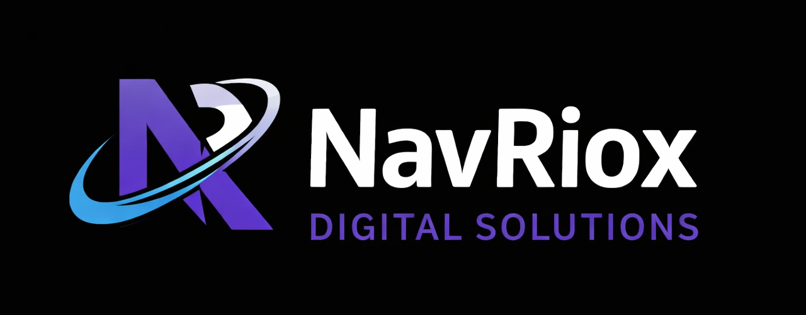

 

<h1 align="center">Navriox Digital Solutions</h1>

  Building modern digital experiences for brands, startups, and growing businesses.

---

## About Navriox

**Navriox Digital Solutions** is a forward-thinking digital agency specializing in crafting impactful digital experiences. We combine strategy, design, and technology to help businesses build strong online presence, scalable products, and meaningful brand connections.

Our approach is design-led, product-focused, and growth-oriented — ensuring every solution we deliver is both visually compelling and functionally effective.

---

## About This Repository

This repository contains the **official website** for Navriox Digital Solutions.

The website serves as:
- A digital identity for the agency  
- A showcase of services and capabilities  
- A platform to communicate vision, process, and value  
- A foundation for future content, case studies, and product offerings  

The site is built with a strong emphasis on:
- Clean and modern UI
- Clear messaging and content hierarchy
- Performance and responsiveness
- Scalability for future expansion

---

## Services Highlighted

The website represents the following core offerings:

- **Web Development**  
  High-performance websites and web applications tailored to business needs.

- **Product Design**  
  End-to-end digital product design from ideation to launch.

- **UI/UX Design**  
  User-centric interfaces focused on usability, clarity, and aesthetics.

- **Social Media Management**  
  Creative content, brand consistency, and strategic online presence.

---

## Website Structure

Key sections included or planned:

- Home & Brand Introduction  
- Services Overview  
- Design & Development Process  
- Work / Case Studies (planned)  
- About the Team & Vision  
- Contact & Lead Capture  

This structure is designed to evolve as the agency grows.

---

## Design Philosophy

Navriox’s website follows these principles:

- Minimal and modern visual language  
- Strong typography and spacing  
- Motion and interaction where it adds value  
- Brand-first color and layout system  
- Mobile-first and responsive design  

---

## Vision

The website is more than a static presence — it is the **digital foundation** of Navriox.

Long-term goals include:
- Publishing case studies and insights  
- Showcasing internal tools and products  
- Supporting content marketing and SEO  
- Acting as a launchpad for SaaS and AI-driven solutions  

---

## Status

🚧 **Actively evolving**

The website is continuously improved to reflect:
- New services
- Brand refinements
- Business growth
- Market positioning

---

## License

© Navriox Digital Solutions  
All rights reserved.

This repository is proprietary and intended solely for Navriox Digital Solutions and authorized collaborators.
